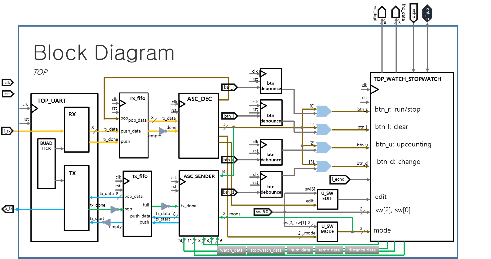
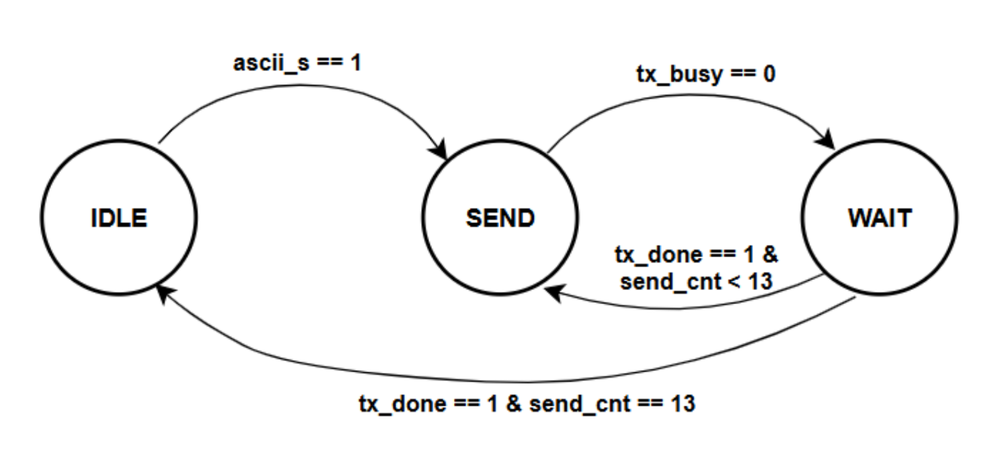
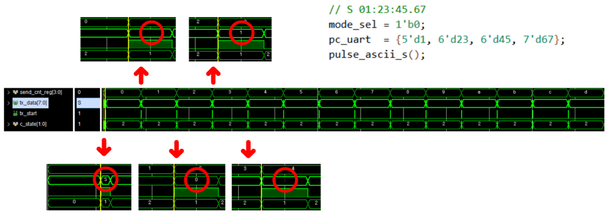
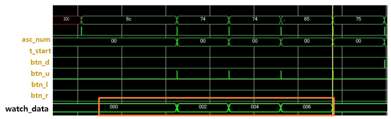
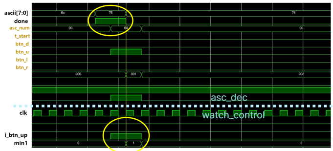
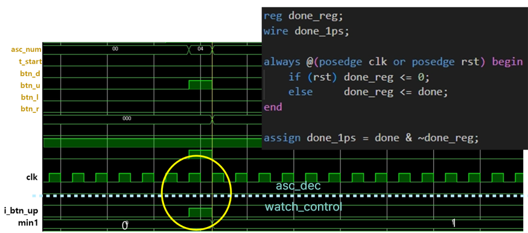
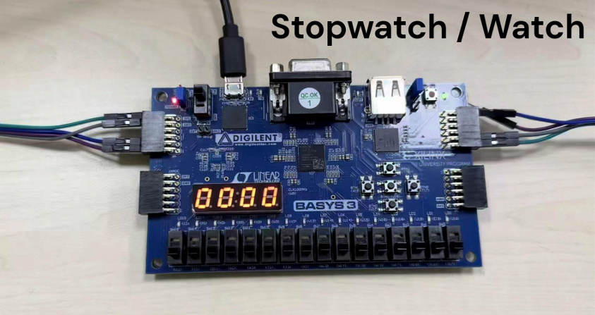

# ⏱️ UART ASCII 통신 기반 FPGA Watch·Stopwatch 시스템

> UART로 수신한 ASCII 명령을 해석해 Watch·Stopwatch를 제어하고,  
> 시간 및 센서 데이터를 ASCII 문자열로 변환하여 PC로 전송하는 FPGA 통합 프로젝트입니다.

---

## 📌 프로젝트 개요

본 프로젝트는 Watch, Stopwatch, DHT11 온·습도 센서, HC-SR04 초음파 거리 센서 및 UART/FIFO 통신 모듈을 하나의 FPGA 시스템으로 통합한 4인 팀 프로젝트입니다.

PC에서 전송한 ASCII 명령은 UART RX와 FIFO를 거쳐 ASCII Decoder로 전달됩니다. Decoder는 수신 문자를 제어 신호로 변환해 Watch·Stopwatch 및 센서 모듈을 동작시킵니다.

각 모듈에서 생성된 시간과 센서 데이터는 FND에 표시되며, ASCII Sender를 통해 사람이 읽을 수 있는 문자열로 변환된 후 UART TX로 PC에 전송됩니다.

본인은 전체 프로젝트 중 **ASCII Decoder·Sender와 Watch·Stopwatch의 Control Unit 및 Datapath 설계**를 담당했습니다.

---

## 📅 수행 기간

**2026.02.23**

---

## 👥 프로젝트 형태

**4인 팀 프로젝트**

UART/FIFO, ASCII 데이터 처리, Watch·Stopwatch, Sensor 모듈을 기능별로 나누어 설계한 뒤 최상위 모듈에서 하나의 FPGA 시스템으로 통합했습니다.

### 팀 구성 및 역할

| 이름 | 담당 영역 | 주요 내용 |
| :---: | --- | --- |
| **김태정** | Top Module | 전체 모듈 연결, 동작 모드 선택 및 시스템 통합 |
| **김지홍** | Sensor | DHT11 온·습도 측정 및 HC-SR04 초음파 거리 측정 모듈 설계 |
| **조준호** | UART + FIFO | UART RX/TX, Baud Tick 및 송수신 FIFO 설계 |
| **최여지** | ASCII + Watch·Stopwatch | ASCII Decoder·Sender, Watch·Stopwatch Control Unit 및 Datapath 설계 |

각 담당자는 개별 모듈의 RTL 설계와 기능 검증을 수행하고, 모듈 간 Interface를 맞춰 최종 시스템으로 통합했습니다.

---

## 🙋 담당 역할

### ASCII Decoder·Sender

- UART로 수신한 ASCII 문자를 제어 신호로 변환하는 Decoder 구현
- `r`, `l`, `u`, `d` 명령을 Watch·Stopwatch 제어 신호로 변환
- Stopwatch, Watch, 거리, 습도, 온도 데이터 요청 명령 해석
- 버튼 입력과 UART 제어 명령을 하나의 공통 제어 신호로 통합
- 시간 및 센서 숫자 데이터를 ASCII 문자로 변환하는 Sender 구현
- Watch·Stopwatch 시간을 `HH:MM:SS:ms` 형식으로 변환
- 거리·온도·습도 데이터를 문자열 형식으로 변환
- `tx_busy` 상태를 확인하며 문자를 순차적으로 전송하는 FSM 구현
- FIFO와 ASCII Sender·Decoder 사이의 데이터 흐름 연동

### Watch·Stopwatch

- Watch 시간 설정 및 실행 제어 FSM 구현
- Watch의 초·분·시 설정 기능 구현
- 설정 대상 선택 및 선택된 시간값 증가 로직 구현
- Stopwatch `STOP → RUN → CLEAR` 상태 제어 구현
- Stopwatch Run/Stop 및 Clear 기능 구현
- 스위치 기반 Stopwatch Up/Down Count 구현
- 100Hz Tick 기반 시간 Counter 설계
- `msec → sec → min → hour` 계층형 Carry 구조 구현
- Parameterized Counter를 이용한 공통 시간 Counter 설계
- Watch·Stopwatch 시간 데이터의 FND 출력 연동

### 통합 및 문제 해결

- ASCII Decoder와 Watch·Stopwatch Control Unit 연결
- Watch·Stopwatch 출력 데이터를 ASCII Sender에 전달
- UART 명령 입력 시 Watch 설정값이 두 번 증가하는 문제 분석
- 2 Clock Pulse를 1 Clock Pulse로 변환해 중복 입력 문제 해결

> UART RX/TX, FIFO 및 Sensor 모듈은 팀원들과 함께 통합했으며,  
> 본인은 ASCII 데이터 처리와 Watch·Stopwatch를 중심으로 구현했습니다.

---

## 🛠 사용 기술

### HDL 및 디지털 설계

- Verilog HDL
- FSM
- Control Unit / Datapath
- Parameterized Counter
- Clock Divider
- Tick Generator
- Multiplexer
- Edge Detector
- Button Debounce

### UART 및 데이터 처리

- UART
- FIFO
- ASCII Encoding / Decoding
- 9600 bps Serial Communication
- Busy/Done Handshake
- Sequential Character Transmission

### Hardware & Tools

- Digilent Basys 3
- Xilinx Artix-7 FPGA
- 4-digit 7-Segment Display
- DHT11
- HC-SR04
- Xilinx Vivado 2020.2
- Functional Simulation
- Waveform Analysis

---

## 🏗 시스템 구성

PC에서 전달한 UART 데이터는 RX FIFO를 통해 ASCII Decoder로 전달됩니다.

ASCII Decoder는 수신 문자를 해석해 Watch·Stopwatch 또는 센서 모듈에 제어 신호를 전달합니다.

각 모듈의 결과 데이터는 FND에 표시되며, ASCII Sender를 거쳐 문자열로 변환된 후 TX FIFO와 UART TX를 통해 PC로 전송됩니다.

<p align="center">
  
</p>

<p align="center">
  <b>UART/FIFO 및 Watch·Stopwatch를 포함한 전체 시스템 구성</b>
</p>

```text
PC UART RX
     ↓
 UART Receiver
     ↓
   RX FIFO
     ↓
ASCII Decoder
     ↓
Control Signal
     ↓
┌────────────┬─────────────┬──────────┬──────────┐
│   Watch    │  Stopwatch  │ HC-SR04  │  DHT11   │
└────────────┴─────────────┴──────────┴──────────┘
     ↓
FND Display / ASCII Sender
                    ↓
                  TX FIFO
                    ↓
                 UART TX
                    ↓
                    PC
```

---

## 🔄 담당 모듈의 데이터 흐름

```text
                 제어 경로

PC
 ↓ UART RX
RX FIFO
 ↓
ASCII Decoder
 ↓
Control Pulse
 ↓
Watch / Stopwatch Control Unit
 ↓
Watch / Stopwatch Datapath


                 출력 경로

Watch / Stopwatch Time Data
 ↓
ASCII Sender
 ↓
TX FIFO
 ↓ UART TX
PC
```

ASCII Decoder가 PC 명령을 FPGA 내부 제어 신호로 변환하고, ASCII Sender가 FPGA 내부 데이터를 PC에서 확인할 수 있는 문자 데이터로 변환하도록 구성했습니다.

---

## 🔡 ASCII Decoder

ASCII Decoder는 UART와 FIFO를 통해 전달된 8-bit ASCII 문자를 해석하고, 해당 명령에 대응하는 제어 신호를 생성합니다.

### 제어 명령

| ASCII | 기능 |
| :---: | --- |
| `r` | Stopwatch Run/Stop |
| `l` | Stopwatch Clear |
| `u` | Watch 설정값 증가 또는 센서 측정 |
| `d` | Watch 설정 대상 변경 |

### 데이터 요청 명령

| ASCII | 대상 |
| :---: | --- |
| `S` | Stopwatch 데이터 |
| `W` | Watch 데이터 |
| `U` | HC-SR04 거리 데이터 |
| `H` | DHT11 습도 데이터 |
| `T` | DHT11 온도 데이터 |

수신 문자는 다음과 같이 각 기능에 대응하는 One-Hot 제어 신호로 변환됩니다.

```text
UART RX Data
      ↓
ASCII Decoder
      ↓
┌────────┬────────┬────────┬────────┐
│ Run    │ Clear  │ Up     │ Shift  │
└────────┴────────┴────────┴────────┘
      ↓
Watch / Stopwatch Control Unit
```

버튼 입력과 UART 명령을 OR 연산으로 결합하여, FPGA 버튼과 PC 명령 중 어느 쪽으로도 같은 기능을 제어할 수 있도록 구성했습니다.

---

## 📤 ASCII Sender

ASCII Sender는 Watch·Stopwatch 시간값과 센서 데이터를 ASCII 문자열로 변환하여 PC로 전송합니다.

FPGA 내부의 숫자 데이터는 그대로 전송하면 사람이 확인하기 어렵기 때문에 각 자릿수를 분리하고 ASCII 숫자로 변환했습니다.

### 출력 데이터 형식

```text
STOPW 01:23:45:67
WATCH 01:23:45:67
ULTRA 123cm
HUMID 45.00
TEMPE 23.00
```

### ASCII 숫자 변환

0부터 9까지의 숫자는 상위 4-bit에 `0x3`을 결합해 ASCII 문자로 변환합니다.

```verilog
tx_data = {4'h3, digit};
```

예를 들어 숫자 `5`는 ASCII 코드 `0x35`로 변환됩니다.

---

## 🧠 ASCII Sender FSM

ASCII Sender는 다음 네 가지 상태로 동작합니다.

| 상태 | 동작 |
| --- | --- |
| `IDLE` | 데이터 전송 명령 대기 |
| `SEND` | 현재 문자를 FIFO로 전달 |
| `WAIT_TX` | FIFO 또는 UART 송신 가능 상태 대기 |
| `NEXT_STEP` | 문자 Index 증가 또는 전송 종료 |

```text
IDLE
  ↓ Send Request
SEND
  ↓
WAIT_TX
  ↓ TX Ready
NEXT_STEP
  ├─ 다음 문자 존재 → SEND
  └─ 문자열 완료 → IDLE
```

한 번에 한 문자만 전송하며, `tx_busy` 상태를 확인한 후 다음 문자로 이동하도록 구현했습니다.

이를 통해 송신 모듈의 처리 속도보다 데이터가 빠르게 전달되어 문자가 누락되는 문제를 방지했습니다.

<p align="center">
  
</p>

<p align="center">
  <b>ASCII Sender의 순차 문자 전송 FSM</b>
</p>

---

## ⏱️ Watch 설계

Watch는 실행 전에 초, 분, 시를 설정할 수 있도록 구현했습니다.

설정 FSM은 `SEC → MIN → HOUR` 순서로 설정 대상을 이동하며, Up 입력이 발생하면 현재 선택된 값만 증가합니다.

- 초: `0~59`
- 분: `0~59`
- 시: `0~23`
- Shift 입력으로 설정할 시간 단위 이동
- Up 입력으로 선택된 시간값 증가
- 설정값 변경 시 Load 신호로 Counter에 반영
- Watch 실행 시 100Hz Tick을 기준으로 시간 증가
- FND 표시 구간 선택 지원

```text
IDLE
  ↓ Shift
SEC → MIN → HOUR
 ↑             │
 └─────────────┘

Up 입력    : 선택된 시간값 증가
Start = 1 : Watch 실행
```

### Watch Control Unit

| 상태 | 동작 |
| --- | --- |
| `IDLE` | 설정 또는 실행 입력 대기 |
| `SEC` | 초 설정 |
| `MIN` | 분 설정 |
| `HOUR` | 시 설정 |
| `UP_SEC` | 초 증가 |
| `UP_MIN` | 분 증가 |
| `UP_HOUR` | 시 증가 |
| `START` | Watch 실행 |

Control Unit은 제어 신호를 생성하고, 실제 설정값과 시간 데이터는 Datapath에서 관리하도록 분리했습니다.

---

## ⏲️ Stopwatch 설계

Stopwatch는 `STOP`, `RUN`, `CLEAR` 상태로 구성했습니다.

| 상태 | 동작 |
| --- | --- |
| `STOP` | 카운트 정지 및 입력 대기 |
| `RUN` | 100Hz Tick 기반 시간 카운트 |
| `CLEAR` | 전체 시간값 초기화 |

Run/Stop 입력이 발생할 때마다 `STOP`과 `RUN` 상태가 전환됩니다.

정지 상태에서 Clear 입력을 받으면 전체 Counter를 0으로 초기화한 후 다시 `STOP` 상태로 복귀합니다.

```text
        Run/Stop
STOP ───────────→ RUN
 ↑                 │
 └─────────────────┘
       Run/Stop

STOP ── Clear ──→ CLEAR ──→ STOP
```

---

## 🔃 Stopwatch Up/Down Count

Stopwatch는 스위치 입력에 따라 증가와 감소 방향을 선택할 수 있도록 구현했습니다.

### Up Count

```text
00:00:00:00
      ↓
00:00:00:01
      ↓
00:00:00:02
```

### Down Count

```text
00:00:00:00
      ↓
23:59:59:99
      ↓
23:59:59:98
```

각 Counter가 범위의 끝에 도달하면 다음 시간 단위로 Carry 또는 Borrow 신호를 전달합니다.

---

## 🔢 계층형 시간 Counter

100MHz FPGA Clock을 분주해 100Hz Tick을 생성하고 이를 밀리초 Counter의 기준 신호로 사용했습니다.

```text
100MHz FPGA Clock
        ↓
100Hz Tick Generator
        ↓
msec Counter (0~99)
        ↓ Carry
sec Counter (0~59)
        ↓ Carry
min Counter (0~59)
        ↓ Carry
hour Counter (0~23)
```

| 시간 단위 | Bit Width | Count 범위 |
| --- | :---: | --- |
| msec | 7-bit | `0~99` |
| sec | 6-bit | `0~59` |
| min | 6-bit | `0~59` |
| hour | 5-bit | `0~23` |

밀리초, 초, 분, 시 Counter는 구조가 같고 Bit Width와 Count 범위만 다릅니다.

따라서 공통 `tick_counter` 모듈에 Parameter를 전달해 각 Counter에 재사용했습니다.

---

## 🖥️ Watch·Stopwatch 출력

Watch와 Stopwatch에서 생성된 24-bit 시간 데이터는 다음과 같이 구성됩니다.

```text
[23:19] : hour
[18:13] : minute
[12:7]  : second
[6:0]   : millisecond
```

시간 데이터는 두 가지 출력 경로로 전달됩니다.

```text
Time Data
   ├─ FND Controller → 4-digit FND
   └─ ASCII Sender → TX FIFO → UART TX → PC
```

<p align="center">
  
</p>

<p align="center">
  <b>Watch·Stopwatch 시간 데이터의 ASCII 문자열 변환 검증</b>
</p>

---

## ⚠️ 문제 해결

### UART Up 명령 입력 시 Watch 값이 두 번 증가하는 문제

UART로 Watch의 Up 명령을 한 번 전송했지만 설정값이 한 번에 2씩 증가하는 문제가 발생했습니다.

<p align="center">
  
</p>

<p align="center">
  <b>한 번의 Up 명령에 Watch 값이 두 번 증가한 현상</b>
</p>

### 원인 분석

ASCII Decoder에서 생성된 제어 신호가 2 Clock 동안 유지되고 있었습니다.

Watch Control Unit은 이 신호를 두 번의 유효 입력으로 인식했고, 그 결과 설정값이 두 번 증가했습니다.

<p align="center">
  
</p>

<p align="center">
  <b>ASCII Decoder와 Watch Control Unit 사이의 제어 신호 분석</b>
</p>

### 해결 방법

이전 `done` 상태를 Register에 저장하고 현재 `done` 상태와 비교하는 Rising Edge Detector를 적용했습니다.

```verilog
reg done_reg;
wire done_1ps;

always @(posedge clk or posedge rst) begin
    if (rst)
        done_reg <= 1'b0;
    else
        done_reg <= done;
end

assign done_1ps = done & ~done_reg;
```

이를 통해 ASCII Decoder가 생성하는 제어 신호를 정확한 1 Clock Pulse로 제한했습니다.

<p align="center">
  
</p>

<p align="center">
  <b>1 Clock Pulse 적용 후 Watch 값이 한 번만 증가하는 결과</b>
</p>

| 구분 | 내용 |
| --- | --- |
| 문제 | 한 번의 UART Up 명령에 Watch 설정값이 2씩 증가 |
| 원인 | ASCII Decoder의 제어 신호가 2 Clock 동안 유지 |
| 해결 | Rising Edge Detector를 적용해 1 Clock Pulse 생성 |
| 결과 | 한 번의 명령에 Watch 설정값이 정확히 1만 증가 |

---

## ✅ 검증 내용

### ASCII Decoder 검증

- UART 수신 문자의 ASCII Code 확인
- `r`, `l`, `u`, `d` 명령 변환 확인
- 기능별 One-Hot 제어 신호 출력 확인
- 버튼 입력과 UART 제어 신호 결합 확인
- 제어 출력이 1 Clock Pulse로 생성되는지 확인

### ASCII Sender 검증

- 시간 데이터의 자릿수 분리 확인
- 숫자 데이터의 ASCII Code 변환 확인
- 문자열이 정해진 순서로 출력되는지 확인
- `tx_busy`에 따른 전송 대기 확인
- 한 문자 전송 완료 후 Index 증가 확인
- 전체 문자열 전송 후 `IDLE` 복귀 확인

### Watch 검증

- 설정 대상의 `SEC → MIN → HOUR` 이동 확인
- Up 입력 시 선택된 시간값만 증가하는지 확인
- 초와 분의 `59 → 0` 순환 확인
- 시의 `23 → 0` 순환 확인
- 설정값 Load 동작 확인
- Watch 실행 후 시간 증가 확인

### Stopwatch 검증

- Run/Stop 입력에 따른 `STOP ↔ RUN` 전환 확인
- Clear 입력 시 전체 Counter 초기화 확인
- Up/Down 모드에 따른 Count 방향 확인
- `99msec → 1sec` Carry 확인
- `59sec → 1min` Carry 확인
- `59min → 1hour` Carry 확인
- `23hour → 0hour` 순환 확인

### 통합 검증

- PC UART 명령을 통한 Watch·Stopwatch 제어 확인
- 시간 데이터의 FND 출력 확인
- 시간 데이터의 ASCII 문자열 변환 확인
- FIFO를 통한 UART 송수신 데이터 전달 확인
- 실제 Basys 3 FPGA 보드 동작 확인

---

## 📸 FPGA 동작 결과

<p align="center">
  
</p>

<p align="center">
  <b>Basys 3에서 Watch·Stopwatch를 실행한 결과</b>
</p>

실제 FPGA 보드에서 다음 기능을 확인했습니다.

- Watch 시간 설정 및 실행
- Stopwatch Run/Stop/Clear
- Stopwatch Up/Down Count
- FND 시간 출력
- UART 명령을 이용한 기능 제어
- 시간 데이터의 ASCII 문자열 변환 및 PC 전송

---

## 📂 소스코드 구조

```text
src/
├── btn/
│   └── btn_debounce.v
│
├── display/
│   ├── top_fnd_controller.v
│   ├── fnd_controller_w_sw.v
│   ├── fnd_controller_dht11.v
│   └── fnd_controller_sr04.v
│
├── sensor/
│   ├── dht_controller.v
│   └── sr04_controller.v
│
├── uart_fifo/
│   ├── uart_top.v
│   └── fifo.v
│
├── watch_stopwatch/
│   ├── watch_ctrl_unit.v
│   ├── watch_datapath.v
│   ├── stopwatch_ctrl_unit.v
│   └── stopwatch_datapath.v
│
└── top_uart_fifo_w_sw_d_t_h.v
```

### 담당 소스 파일

| 파일 | 담당 내용 |
| --- | --- |
| `uart_top.v` | ASCII Decoder·Sender 및 UART 데이터 연동 |
| `watch_ctrl_unit.v` | Watch 설정 대상 선택 및 실행 제어 FSM |
| `watch_datapath.v` | Watch 설정값과 시간 Counter Datapath |
| `stopwatch_ctrl_unit.v` | Stopwatch Run/Stop/Clear FSM |
| `stopwatch_datapath.v` | 100Hz 기반 계층형 Up/Down Counter |

### 통합 소스 파일

| 파일 | 내용 |
| --- | --- |
| `fifo.v` | UART 송수신 데이터 버퍼링 |
| `btn_debounce.v` | 버튼 Chattering 제거 |
| `fnd_controller_w_sw.v` | Watch·Stopwatch 시간 데이터 FND 출력 |
| `dht_controller.v` | DHT11 온·습도 데이터 처리 |
| `sr04_controller.v` | HC-SR04 거리 측정 |
| `top_uart_fifo_w_sw_d_t_h.v` | 전체 시스템 최상위 모듈 |

> Vivado에서 자동 생성되는 `.cache`, `.runs`, `.sim`, `.hw`, `.Xil` 디렉터리는 소스코드에서 제외했습니다.

---

## 💡 프로젝트를 통해 배운 점

ASCII Decoder와 Sender를 설계하면서 FPGA 내부의 Binary Data와 PC에서 사용하는 ASCII 문자열 사이의 변환 과정을 이해할 수 있었습니다.

UART는 한 번에 한 문자만 전송하기 때문에 `busy`, `done` 신호와 문자 Index를 이용한 순차 전송 제어가 중요하다는 점을 확인했습니다.

Watch와 Stopwatch를 Control Unit과 Datapath로 분리하면서 FSM이 제어 신호를 생성하고 Counter가 실제 시간 데이터를 처리하는 구조를 경험했습니다.

또한 UART 입력으로 Watch 설정값이 두 번 증가하는 문제를 파형으로 분석하고, Edge Detector를 적용해 제어 신호를 1 Clock Pulse로 변환하면서 모듈 사이의 정확한 신호 폭과 타이밍이 시스템 동작에 직접적인 영향을 준다는 점을 배웠습니다.

---

## 📄 발표 자료

전체 시스템 설계 및 검증 과정은 아래 발표 자료에서 확인할 수 있습니다.

<p align="center">
  <a href="./docs/260224_fpga_design_project.pdf">
    <b>📑 프로젝트 발표 자료 보기</b>
  </a>
</p>

---

*UART ASCII 통신 기반 FPGA Watch·Stopwatch 시스템*
