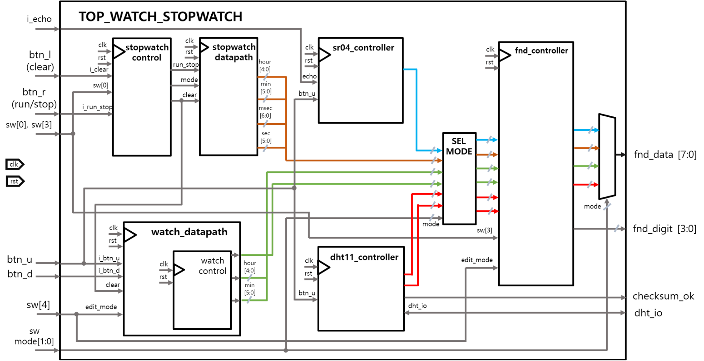

# ⏱️ FPGA 기반 Watch·Stopwatch 및 Sensor 통합 시스템

> Watch와 Stopwatch를 중심으로 DHT11 온·습도 센서, HC-SR04 초음파 거리 센서,  
> UART/FIFO 통신 및 FND 출력을 하나의 FPGA 시스템으로 통합한 4인 팀 프로젝트입니다.

---

## 📌 프로젝트 개요

본 프로젝트는 시간 제어, 센서 데이터 측정, UART 통신처럼 서로 다른 타이밍과 기능을 가진 모듈을 하나의 FPGA 시스템으로 통합한 프로젝트입니다.

Basys 3 FPGA에서 Watch와 Stopwatch를 구현하고, DHT11 온·습도 센서 및 HC-SR04 초음파 거리 센서를 연동했습니다.

버튼과 스위치를 이용해 각 기능을 직접 제어할 수 있으며, PC에서 전달된 UART 명령을 ASCII Decoder로 해석해 동일한 기능을 제어할 수도 있습니다.

Watch·Stopwatch의 시간 데이터와 센서 측정 결과는 4-digit 7-Segment Display(FND)에 표시되며, ASCII 문자열로 변환해 UART를 통해 PC로 전송하도록 구성했습니다.

본인은 전체 프로젝트 중 **Watch와 Stopwatch의 Control Unit, Datapath, 시간 설정 및 계층형 Counter 설계**를 담당했습니다.

---

## 📅 수행 기간

**2026.02**

---

## 👥 프로젝트 형태

**4인 팀 프로젝트**

| 팀원 |
| :---: |
| 김태정 |
| 김지홍 |
| 조준호 |
| 최여지 |

각 팀원이 Watch·Stopwatch, UART/FIFO, ASCII 데이터 처리, 센서 제어 등의 기능을 나누어 구현한 뒤 최상위 모듈에서 하나의 시스템으로 통합했습니다.

---

## 🙋 담당 역할

- Watch Control Unit FSM 설계
- Watch 초·분·시 설정 기능 구현
- 설정할 시간 단위 선택 및 값 증가 로직 구현
- Stopwatch `STOP → RUN → CLEAR` 상태 제어 구현
- Stopwatch 시작·정지 및 초기화 기능 구현
- 스위치 기반 Stopwatch Up/Down Count 구현
- 100Hz Tick 기반 시간 Counter 설계
- `msec → sec → min → hour` 계층형 Carry 구조 구현
- Parameterized Counter를 이용한 공통 Counter 모듈 설계
- Watch·Stopwatch 시간 데이터의 FND 출력 연동
- 버튼 입력과 UART 제어 신호의 공통 제어 경로 연동
- UART 입력 시 Watch 설정값이 두 번 증가하는 문제 분석 및 해결

> DHT11, HC-SR04, UART/FIFO 및 ASCII Sender·Decoder는 팀원들과 함께 통합했으며,  
> 본인은 Watch와 Stopwatch의 제어 및 데이터 경로를 중심으로 구현했습니다.

---

## 🛠 사용 기술

### HDL 및 디지털 설계

- Verilog HDL
- FSM
- Control Unit / Datapath
- Parameterized Counter
- Clock Divider
- Tick Generator
- Multiplexer
- Edge Detector
- Button Debounce

### 통신 및 데이터 처리

- UART
- FIFO
- ASCII Encoder / Decoder
- 9600 bps Serial Communication
- Busy/Done Handshake

### 센서

- DHT11 온·습도 센서
- HC-SR04 초음파 거리 센서
- 비동기 입력 Synchronizer
- Checksum 검증

### Hardware & Tools

- Digilent Basys 3
- Xilinx Artix-7 FPGA
- 4-digit 7-Segment Display
- Xilinx Vivado 2020.2
- Functional Simulation
- Waveform Analysis

---

## 🔧 Hardware 구성

| 장치 | 역할 |
| --- | --- |
| Basys 3 | 전체 RTL 실행 및 시스템 제어 |
| 4-digit FND | 시간, 거리, 온도, 습도 출력 |
| HC-SR04 | 초음파 Pulse Delay 기반 거리 측정 |
| DHT11 | 실시간 온도 및 습도 측정 |
| PC | UART 명령 전송 및 측정 결과 수신 |

---

## 🏗 시스템 구성

UART RX로 수신한 데이터는 RX FIFO를 거쳐 ASCII Decoder로 전달됩니다.

ASCII Decoder는 명령어를 해석해 Watch·Stopwatch 또는 센서 모듈에 제어 신호를 전달합니다.

각 모듈에서 생성된 시간 및 센서 데이터는 FND Controller를 통해 표시되며, ASCII Sender와 TX FIFO를 거쳐 PC로 전송됩니다.

<p align="center">
  
</p>

<p align="center">
  <b>UART/FIFO 및 Watch·Stopwatch를 포함한 전체 시스템 구성</b>
</p>

```text
PC UART RX
     ↓
 UART Receiver
     ↓
   RX FIFO
     ↓
ASCII Decoder
     ↓
Button Control Signal
     ↓
┌────────────┬─────────────┬──────────┬──────────┐
│   Watch    │  Stopwatch  │ HC-SR04  │  DHT11   │
└────────────┴─────────────┴──────────┴──────────┘
     ↓
Mode Multiplexer
     ↓
FND Display / ASCII Sender
                    ↓
                  TX FIFO
                    ↓
                 UART TX
                    ↓
                    PC
```

---

## ⚙️ Watch·Stopwatch 및 Sensor 구성

Watch와 Stopwatch는 각각 Control Unit과 Datapath로 구성했습니다.

Control Unit은 버튼과 스위치 입력을 해석해 실행, 정지, 초기화 및 시간 설정 신호를 생성합니다.

Datapath는 100Hz Tick을 이용해 실제 시간 데이터를 계산하며, 센서 데이터와 함께 Mode Multiplexer를 거쳐 FND Controller로 전달됩니다.

<p align="center">
  
</p>

<p align="center">
  <b>Watch·Stopwatch·Sensor 및 FND 연동 구조</b>
</p>

---

## 🎛 입력 및 제어 방법

버튼과 스위치를 이용한 직접 제어와 UART ASCII 명령을 이용한 원격 제어를 모두 지원하도록 구성했습니다.

<p align="center">
  
</p>

<p align="center">
  <b>Basys 3 버튼·스위치 및 UART 입력 구성</b>
</p>

### 버튼 제어

| 입력 | 기능 |
| --- | --- |
| `btn_r` | Stopwatch Run/Stop |
| `btn_l` | Stopwatch Clear |
| `btn_u` | Watch 설정값 증가 또는 센서 측정 시작 |
| `btn_d` | Watch 설정 단위 변경 |

### 스위치 제어

| 입력 | 기능 |
| --- | --- |
| `sw[0]` | Stopwatch Up/Down Count 방향 선택 |
| `sw[1]` | Watch/Stopwatch 또는 Sensor 세부 모드 선택 |
| `sw[2]` | FND 시간 표시 구간 선택 |
| `sw[3]` | Watch 실행 |
| `sw[4]` | 시간/Sensor 출력 모드 선택 |
| `sw[5]` | DHT11 습도/온도 선택 |

### UART 제어

| ASCII | 기능 |
| :---: | --- |
| `r` | Run/Stop |
| `l` | Clear |
| `u` | Watch 설정값 증가 또는 센서 측정 |
| `d` | Watch 설정 단위 이동 |

---

## ✨ 주요 구현 내용

### 1. Watch 시간 설정

Watch는 실행 전에 초, 분, 시를 각각 설정할 수 있도록 구현했습니다.

설정 FSM은 `SEC → MIN → HOUR` 순서로 설정 대상을 이동하며, Up 입력이 발생하면 현재 선택된 값만 증가합니다.

- 초: `0~59`
- 분: `0~59`
- 시: `0~23`
- Shift 입력으로 설정할 시간 단위 이동
- Up 입력으로 선택된 시간값 증가
- 설정값 변경 시 Load 신호로 Counter에 반영
- Watch 실행 시 100Hz Tick을 기준으로 시간 증가
- FND 표시 구간을 스위치로 선택

```text
IDLE
  ↓ Shift
SEC → MIN → HOUR
 ↑             │
 └─────────────┘

Up 입력    : 선택된 시간값 증가
Start = 1 : Watch 실행
```

---

### 2. Watch Control Unit

Watch Control Unit은 시간 설정과 실행 상태를 제어합니다.

| 상태 | 동작 |
| --- | --- |
| `IDLE` | 설정 또는 실행 입력 대기 |
| `SEC` | 초 설정 |
| `MIN` | 분 설정 |
| `HOUR` | 시 설정 |
| `UP_SEC` | 초 증가 |
| `UP_MIN` | 분 증가 |
| `UP_HOUR` | 시 증가 |
| `START` | Watch 실행 |

FSM은 제어 신호만 생성하고 실제 시간값은 Datapath에서 처리하도록 Control Unit과 Datapath를 분리했습니다.

---

### 3. Stopwatch FSM

Stopwatch는 `STOP`, `RUN`, `CLEAR` 상태로 구성했습니다.

| 상태 | 동작 |
| --- | --- |
| `STOP` | 카운트 정지 및 입력 대기 |
| `RUN` | 100Hz Tick 기반 시간 카운트 |
| `CLEAR` | 전체 시간값 초기화 |

Run/Stop 버튼을 누를 때마다 `STOP`과 `RUN` 상태가 전환됩니다.

정지 상태에서 Clear 버튼을 누르면 전체 Counter가 0으로 초기화된 후 다시 `STOP` 상태로 복귀합니다.

```text
        Run/Stop
STOP ───────────→ RUN
 ↑                 │
 └─────────────────┘
       Run/Stop

STOP ── Clear ──→ CLEAR ──→ STOP
```

---

### 4. Stopwatch Up/Down Count

Stopwatch는 스위치 입력에 따라 증가 또는 감소 방향을 선택할 수 있도록 구현했습니다.

#### Up Count

```text
00:00:00:00
      ↓
00:00:00:01
      ↓
00:00:00:02
```

#### Down Count

```text
00:00:00:00
      ↓
23:59:59:99
      ↓
23:59:59:98
```

각 Counter가 범위의 끝에 도달하면 다음 시간 단위로 Carry 또는 Borrow 신호를 전달합니다.

---

### 5. 계층형 시간 Counter

100MHz FPGA Clock을 분주해 100Hz Tick을 생성하고 이를 밀리초 Counter의 기준 신호로 사용했습니다.

```text
100MHz FPGA Clock
        ↓
100Hz Tick Generator
        ↓
msec Counter (0~99)
        ↓ Carry
sec Counter (0~59)
        ↓ Carry
min Counter (0~59)
        ↓ Carry
hour Counter (0~23)
```

| 시간 단위 | Bit Width | Count 범위 |
| --- | :---: | --- |
| msec | 7-bit | `0~99` |
| sec | 6-bit | `0~59` |
| min | 6-bit | `0~59` |
| hour | 5-bit | `0~23` |

Bit Width와 Count 범위를 Parameter로 전달하는 공통 `tick_counter`를 설계해 동일한 Counter 구조를 재사용했습니다.

---

### 6. UART 및 FIFO

UART는 송수신 타이밍을 맞추기 위해 비동기 직렬 통신 방식으로 구현했습니다.

UART는 한 번에 1Byte만 전송할 수 있으므로, 모듈 사이의 처리 속도 차이에 따른 데이터 손실을 방지하기 위해 TX/RX FIFO를 적용했습니다.

```text
PC
 ├─ UART RX → RX FIFO → ASCII Decoder
 └─ UART TX ← TX FIFO ← ASCII Sender
```

- UART RX/TX FSM 구현
- 9600 bps Baud Tick 생성
- RX/TX FIFO를 통한 데이터 버퍼링
- FIFO `empty`, `full`, `push`, `pop` 상태 제어
- UART `busy`, `done` 신호 기반 순차 전송
- 통신 모듈과 기능 모듈의 동작 타이밍 분리

---

### 7. ASCII Sender 및 Decoder

PC에서 전달한 ASCII 명령은 Decoder에서 제어 신호로 변환됩니다.

반대로 Watch·Stopwatch의 시간값과 센서 측정값은 ASCII Sender에서 사람이 읽을 수 있는 문자열로 변환됩니다.

<p align="center">
  
</p>

<p align="center">
  <b>시간 데이터의 ASCII 문자열 변환 검증</b>
</p>

- 숫자 데이터를 ASCII 문자로 변환
- 시간, 거리, 습도, 온도 데이터를 문자열로 구성
- UART `busy` 상태 확인 후 다음 문자 전송
- 한 문자열의 전송이 완료될 때까지 문자 Index 관리
- FIFO를 이용한 송신 데이터 손실 방지

---

### 8. HC-SR04 초음파 거리 센서

HC-SR04 Controller는 10μs Trigger Pulse를 출력하고 Echo Pulse의 길이를 측정해 거리를 계산합니다.

```text
IDLE
  ↓ Start
START
  ↓ 10μs Trigger
WAIT
  ↓ Echo
DISTANCE
  ↓ Echo 종료
IDLE
```

- 1MHz Tick 생성
- 10μs Trigger Pulse 출력
- Echo 입력 대기
- Echo High 구간 측정
- 약 58μs 단위로 거리 환산
- 최대 400cm 범위 처리
- 비동기 Echo 입력에 2단 Synchronizer 적용

<p align="center">
  
</p>

<p align="center">
  <b>HC-SR04의 10μs Trigger Pulse 및 상태 전환 검증</b>
</p>

---

### 9. DHT11 온·습도 센서

DHT11 Controller는 단일 양방향 데이터 라인을 이용해 센서와 통신합니다.

```text
IDLE
  ↓
START
  ↓
WAIT
  ↓
SYNC_L
  ↓
SYNC_H
  ↓
DATA_SYNC
  ↓
DATA_COLLECT
  ↓
STOP
```

- 약 19ms Start 신호 생성
- Sensor 응답 Low/High 구간 확인
- Pulse Width에 따라 Logic `0`, `1` 판별
- 40-bit 온·습도 데이터 수집
- Checksum 비교
- Checksum이 일치한 경우에만 온도와 습도 갱신

<p align="center">
  
</p>

<p align="center">
  <b>DHT11 40-bit 데이터 수집 및 Checksum 검증 결과</b>
</p>

---

## ⚠️ 문제 해결

### UART 입력 시 Watch 값이 두 번 증가하는 문제

UART로 Watch의 Up 명령을 한 번 전송했지만 Watch 설정값이 두 번 증가하는 문제가 발생했습니다.

<p align="center">
  
</p>

<p align="center">
  <b>한 번의 Up 입력에 Watch 값이 두 번 증가한 현상</b>
</p>

### 원인 분석

ASCII Decoder에서 생성된 제어 신호가 2 Clock 동안 유지되고 있었습니다.

Watch Control Unit은 해당 신호를 두 번의 유효 입력으로 인식했고, 그 결과 설정값이 2씩 증가했습니다.

<p align="center">
  
</p>

<p align="center">
  <b>ASCII Decoder와 Watch Control Unit 사이의 2 Clock Pulse 분석</b>
</p>

### 해결 방법

이전 `done` 상태를 Register에 저장하고 현재 `done`과 비교하는 Edge Detector를 적용했습니다.

```verilog
reg done_reg;
wire done_1ps;

always @(posedge clk or posedge rst) begin
    if (rst)
        done_reg <= 1'b0;
    else
        done_reg <= done;
end

assign done_1ps = done & ~done_reg;
```

이를 통해 ASCII Decoder의 제어 출력을 1 Clock Pulse로 제한했습니다.

<p align="center">
  
</p>

<p align="center">
  <b>1 Clock Pulse 적용 후 Watch 값이 한 번만 증가하는 결과</b>
</p>

| 구분 | 내용 |
| --- | --- |
| 문제 | 한 번의 UART Up 명령에 Watch 설정값이 2씩 증가 |
| 원인 | ASCII Decoder의 제어 신호가 2 Clock 동안 유지 |
| 해결 | Rising Edge 검출을 적용해 1 Clock Pulse 생성 |
| 결과 | 한 번의 명령에 설정값이 정확히 1만 증가 |

---

## ✅ 검증 내용

### Watch 검증

- 설정 대상의 `SEC → MIN → HOUR` 이동 확인
- Up 입력 시 선택된 시간값만 증가하는지 확인
- 초와 분의 `59 → 0` 순환 확인
- 시의 `23 → 0` 순환 확인
- UART 명령이 1 Clock Pulse로 전달되는지 확인
- Watch 실행 후 시간 증가 확인

### Stopwatch 검증

- Run/Stop 입력에 따른 `STOP ↔ RUN` 상태 전환 확인
- Clear 입력 시 전체 Counter 초기화 확인
- Up/Down 모드에 따른 Count 방향 확인
- `99msec → 1sec` Carry 확인
- `59sec → 1min` Carry 확인
- `59min → 1hour` Carry 확인
- `23hour → 0hour` 순환 확인

### UART/FIFO 검증

- UART RX 수신 데이터 확인
- RX FIFO Push/Pop 동작 확인
- ASCII Decoder의 명령 변환 확인
- 측정 데이터의 ASCII 문자열 변환 확인
- TX FIFO를 통한 순차 데이터 전송 확인
- `tx_start`, `tx_busy`, `tx_done` 신호 흐름 확인

### Sensor 검증

- HC-SR04의 10μs Trigger Pulse 확인
- Echo Pulse Width에 따른 거리 계산 확인
- Echo 입력 Synchronizer 동작 확인
- DHT11 Start 및 응답 신호 확인
- 40-bit 데이터 수집 확인
- Checksum 일치 시 온·습도 데이터 갱신 확인

### 통합 검증

- PC UART 명령을 통한 동작 모드 변경 확인
- 버튼과 UART 명령의 공통 제어 경로 확인
- 시간 및 센서 데이터의 FND 출력 확인
- 측정 결과의 ASCII 변환 및 PC 송신 확인
- 실제 Basys 3 FPGA 보드 동작 확인

---

## 📸 FPGA 동작 결과

<p align="center">
  
</p>

<p align="center">
  <b>Basys 3에서 Watch·Stopwatch를 실행한 결과</b>
</p>

실제 FPGA 보드에서 다음 기능을 확인했습니다.

- Watch 시간 설정 및 실행
- Stopwatch Run/Stop/Clear
- Stopwatch Up/Down Count
- FND 시간 출력
- 센서 데이터 측정
- UART 기반 PC 명령 제어
- ASCII 형식의 결과 데이터 송신

---

## 📂 소스코드 구조

```text
src/
├── btn/
│   └── btn_debounce.v
│
├── display/
│   ├── top_fnd_controller.v
│   ├── fnd_controller_w_sw.v
│   ├── fnd_controller_dht11.v
│   └── fnd_controller_sr04.v
│
├── sensor/
│   ├── dht_controller.v
│   └── sr04_controller.v
│
├── uart_fifo/
│   ├── uart_top.v
│   └── fifo.v
│
├── watch_stopwatch/
│   ├── watch_ctrl_unit.v
│   ├── watch_datapath.v
│   ├── stopwatch_ctrl_unit.v
│   └── stopwatch_datapath.v
│
└── top_uart_fifo_w_sw_d_t_h.v
```

### 폴더 설명

| 폴더 | 내용 |
| --- | --- |
| `btn` | 기계식 버튼의 Chattering을 제거하는 Debounce 모듈 |
| `display` | Watch·Stopwatch 및 Sensor 데이터를 FND에 표시 |
| `sensor` | DHT11과 HC-SR04 센서 제어 및 데이터 처리 |
| `uart_fifo` | UART 송수신, ASCII 변환 및 FIFO 버퍼링 |
| `watch_stopwatch` | Watch·Stopwatch Control Unit과 Datapath |
| `top_uart_fifo_w_sw_d_t_h.v` | 전체 기능을 연결하는 최상위 모듈 |

### 주요 소스 파일

| 파일 | 내용 |
| --- | --- |
| `watch_ctrl_unit.v` | Watch 설정 대상 선택 및 실행 제어 FSM |
| `watch_datapath.v` | Watch 설정값 및 시간 Counter Datapath |
| `stopwatch_ctrl_unit.v` | Stopwatch Run/Stop/Clear FSM |
| `stopwatch_datapath.v` | 100Hz 기반 계층형 Up/Down Counter |
| `dht_controller.v` | DHT11 통신 FSM과 온·습도 데이터 처리 |
| `sr04_controller.v` | HC-SR04 Trigger/Echo 제어 및 거리 계산 |
| `top_fnd_controller.v` | 시간·거리·온습도 FND 출력 선택 |
| `uart_top.v` | UART RX/TX 및 ASCII 변환 |
| `fifo.v` | UART 송수신 데이터 버퍼링 |
| `btn_debounce.v` | 버튼 Chattering 제거 |
| `top_uart_fifo_w_sw_d_t_h.v` | 전체 시스템 최상위 모듈 |

> Vivado에서 자동 생성되는 `.cache`, `.runs`, `.sim`, `.hw`, `.Xil` 디렉터리는 소스코드에서 제외했습니다.

---

## 💡 프로젝트를 통해 배운 점

Watch와 Stopwatch를 Control Unit과 Datapath로 분리하면서 FSM이 제어 신호를 생성하고 Counter가 실제 시간 데이터를 처리하는 구조를 이해할 수 있었습니다.

동일한 Parameterized Counter를 여러 시간 단위에 재사용하고 Carry 신호로 연결하면서 계층형 디지털 시스템의 설계 방법을 익혔습니다.

또한 UART, FIFO, Watch, Stopwatch, Sensor처럼 서로 다른 동작 주기를 가진 모듈을 통합하면서 데이터 손실을 방지하기 위한 버퍼링과 정확한 제어 Pulse의 중요성을 확인했습니다.

특히 UART 입력에 의해 Watch 설정값이 두 번 증가하는 문제를 파형으로 분석하고, Edge Detector를 적용해 1 Clock Pulse로 변환하면서 모듈 사이의 제어 신호 폭이 전체 동작에 직접적인 영향을 준다는 점을 경험했습니다.

---

## 📄 발표 자료

전체 시스템 설계와 검증 과정은 아래 발표 자료에서 확인할 수 있습니다.

<p align="center">
  <a href="./docs/fpga_design_project_presentation.pdf">
    <b>📑 프로젝트 발표 자료 보기</b>
  </a>
</p>

---

*FPGA 기반 Watch·Stopwatch 및 DHT11·HC-SR04 Sensor 통합 프로젝트*
